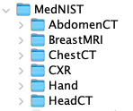

# Identifying and Designing Neural Networks
This repository shows an example of how to use MATLAB and the Deep Network Designer app to build deep learning solutions to two different problems:
1. Diabetes prediction
2. Medical image classification.
## Part 1: Diabetes prediction
### Problem
Given (tabular) anonymized health data about the incidence of a diabetes in a given population, design a binary classifier to predict whether an individual with certain health indicators is likely to develop diabetes or not.
### Dataset
We will use the [Kaggle's version of the Pima Indians diabetes database](https://www.kaggle.com/uciml/pima-indians-diabetes-database).

The dataset consists of several medical predictor variables (such as age, BMI, insulin level, and number of pregnancies) and one target variable, `Outcome`. 

See https://www.ncbi.nlm.nih.gov/pmc/articles/PMC7270283/ for an example of a recent scientific article using this dataset.
### Solution
We build a fully connected feedforward neural network from scratch using the Deep Network Designer app and test the resulting model to determine its accuracy.
## Part 2: Medical image modality classification
### Problem
Given a collection of medical images from 6 different modalities, design a multiclass classifier to label a previously unseen image according to the category (modality) to which it should belong.
### Dataset
The MedNIST dataset was created for educational purposes and contains medical images gathered from several sets from TCIA, the RSNA Bone Age Challenge, and the NIH Chest X-ray dataset. The name MedNIST was inspired by the popular MNIST dataset, which has been called "the 'Hello World' of deep learning." The main difference is that, instead of containing images of handwritten digits, MedNIST contains medical images.

There are 6 folders in the dataset: Hand, AbdomenCT, CXR, ChestCT, BreastMRI, HeadCT, whose names should be used as the labels to train our classification model.

The dataset is kindly made available by Dr. Bradley J. Erickson M.D., Ph.D. (Department of Radiology, Mayo Clinic) under the Creative Commons CC BY-SA 4.0 license. If you use the MedNIST dataset, please acknowledge the source.
### Solution
In this part we build an image classifier starting from a pre-trained (on ImageNet) CNN under the transfer learning paradigm. Once again, we use the Deep Network Designer app to build our solution by following these steps:
1. Open the Deep Network Designer app and choose a pretrained network.
2. Import the new data set.
3. Replace the final layers with new layers adapted to the new data set.
4. Set learning rates so that learning is faster in the new layers than in the transferred layers.
5. Train the network using Deep Network Designer, or export the network for training at the command line.
## Requirements
- [X]  [MATLAB 2021a](https://www.mathworks.com/products/matlab.html) or later
- [X]  [Deep Learning Toolbox](https://www.mathworks.com/products/deep-learning.html)
- [ ]  [Parallel Computing Toolbox](https://www.mathworks.com/products/parallel-computing.html) (only required for training using a GPU)
## Suggested steps
1. Download or clone the repository.
2. Download the MedNIST dataset using [this link](https://drive.google.com/uc?id=1QsnnkvZyJPcbRoV_ArW8SnE1OTuoVbKE).

Once you open the file and expand it, it should produce a folder structure where each folder is named with the image category.

|  |
|:--:|
| MedNIST folder structure.|

3. Open MATLAB.
4. Run the `design_nn_matlab.mlx` script and inspect results.
## Additional remarks
- You are encouraged to expand and adapt the example to your needs.
- The choice of network architecture for Part 1 and pretrained model for Part 2 is merely illustrative, and so are the choice of  hyperparameters (learning rate, mini-batch size, number of epochs, etc.). You are encouraged to (use [Experiment Manager](https://www.mathworks.com/help/deeplearning/ref/experimentmanager-app.html) to) tweak those choices and find a better solution [1](#myfootnote1).
## Notes
<a name="myfootnote1">[1]</a> See [this](https://www.mathworks.com/matlabcentral/fileexchange/93980-managing-medical-image-classification-experiments?s_tid=prof_contriblnk) for ideas and example code for using MATLAB Experiment Manager.   
